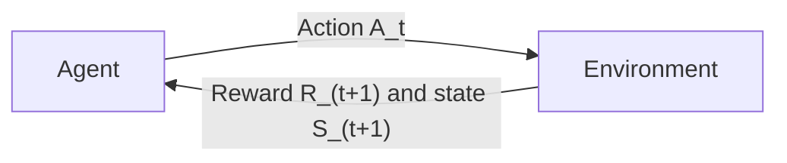
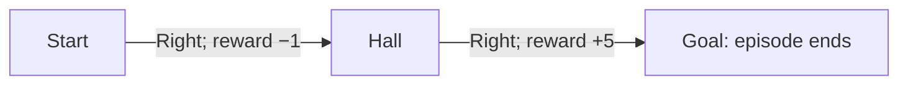

An agent makes decisions; its environment responds. A **Markov decision process (MDP)** describes this interaction when the current state provides enough information to predict what happens next, given the action.

## The interaction loop

At each time step $t$:

1. The agent observes the current state $S_t$.
2. It chooses an action $A_t$.
3. The environment produces a reward $R_{t+1}$ and a next state $S_{t+1}$.
4. The agent repeats from the new state, unless the episode has ended.

The reward is labeled $R_{t+1}$ because it arrives **after** action $A_t$. The resulting sequence is a **trajectory**:

$$
S_0, A_0, R_1, S_1, A_1, R_2, S_2, \ldots
$$

The agent–environment boundary describes what the decision-maker controls. For a robot, choosing a motor command is an action; the resulting motion is part of the environment's response. The environment can include parts of the robot's own body.

## A tiny gridworld for this chapter

Imagine a robot moving through this grid:

| | Column 1 | Column 2 | Column 3 |
| --- | --- | --- | --- |
| Top row | Start | Hall | Goal |
| Bottom row | B | C | D |

The state is the robot's current cell. Its actions are up, down, left, and right. A move deterministically reaches the neighboring cell in that direction; attempting to cross the outer wall leaves the robot in place.

Entering Goal gives **+5** and ends the episode. Every other move gives **−1**, including attempts to cross a wall. The final +5 replaces the usual −1; it is not +4.

For example, moving right twice produces:

## The vocabulary

| Concept | Meaning | Gridworld example |
| --- | --- | --- |
| State $s$ | Current situation | The robot is in Hall. |
| Action $a$ | Choice available now | Move right. |
| Transition | Next state after an action | Hall → Goal. |
| Reward $r$ | Numerical feedback after an action | +5 on entering Goal. |
| Policy $\pi$ | Rule for choosing actions | Choose right in Start and Hall. |
| Return $G_t$ | Total future reward, possibly discounted | The score for the rest of the route. |
| Value | Expected return under a policy | How good it is to start in Hall. |

An MDP specifies the states $\mathcal{S}$, available actions $\mathcal{A}(s)$, and environment dynamics. A discounted-return objective also specifies a discount factor $\gamma$. The policy describes the agent's behavior within this problem; changing the policy does not change the environment's rules.

## The transition and reward model

For a finite MDP, the joint model is:

$$
p(s',r \mid s,a) = \Pr(S_{t+1}=s', R_{t+1}=r \mid S_t=s, A_t=a).
$$

Read it as: “Given this state and action, how likely are this next state and reward?” For each valid state–action pair, the probabilities over all possible outcomes sum to one:

$$
\sum_{s',r} p(s',r \mid s,a) = 1.
$$

In our gridworld, $p(\text{Goal},5 \mid \text{Hall},\text{right})=1$. A slippery version could move right with probability 0.8 and stay put with probability 0.2. The agent chooses an action; it does not choose which random outcome occurs.

### A textbook example: the recycling robot

Sutton & Barto's Example 3.3 gives a $p(s',r \mid s,a)$ table with real randomness in it. A robot collects cans and has a battery that is either HIGH or LOW. It can `SEARCH` for cans, `WAIT` in place, or `RECHARGE`. Searching pays the most but risks draining the battery; recharging is free but forfeits a turn.

| State | Action | Next state | Probability | Reward |
| --- | --- | --- | --- | --- |
| HIGH | SEARCH | HIGH | $\alpha$ | $r_{\text{search}}$ |
| HIGH | SEARCH | LOW | $1-\alpha$ | $r_{\text{search}}$ |
| HIGH | WAIT | HIGH | 1 | $r_{\text{wait}}$ |
| LOW | SEARCH | LOW | $\beta$ | $r_{\text{search}}$ |
| LOW | SEARCH | HIGH | $1-\beta$ | $-3$ (rescued) |
| LOW | WAIT | LOW | 1 | $r_{\text{wait}}$ |
| LOW | RECHARGE | HIGH | 1 | 0 |

This is a genuinely stochastic, continuing task (no terminal state), which makes it a better test case than the gridworld for checking that you can read a dynamics table rather than just a deterministic diagram.

`toy-recycle-bot.py` in this chapter's folder implements it as a Gymnasium environment. It checks its own deterministic transitions with assertions before running a random-policy demo, so `python toy-recycle-bot.py` both verifies and demonstrates the dynamics above.

## What makes the state Markov?

**The current state contains the information needed to predict the next state and reward, given the action.** Earlier history adds nothing to that prediction:

$$
\Pr(S_{t+1}=s', R_{t+1}=r \mid S_t,A_t,\text{earlier history}) = \Pr(S_{t+1}=s', R_{t+1}=r \mid S_t,A_t).
$$

Location is enough for our gridworld. But if entering Goal requires a key, “Hall with a key” and “Hall without a key” have different possible outcomes. The state must then include both location and whether the robot has the key. Battery level or time remaining may also need to be included when they affect the rules.

Markov does not mean deterministic: the slippery robot can still be Markov if its outcome probabilities depend only on its current state and action.

What if the agent cannot observe the full state?

A partially observable MDP (POMDP) distinguishes the true state $S_t$ from the observation $O_t$ available to the agent. For example, a robot's camera may not reveal what is behind a wall.

One approach maintains a **belief state**, a probability distribution over possible states based on the action and observation history $H_t$:

$$
b_t(s) = \Pr(S_t=s \mid H_t).
$$

This chapter uses fully observed states. The distinction matters when deciding whether the information available to an agent really is a Markov state.

## Reference

Sutton, R. S. & Barto, A. G. *Reinforcement Learning: An Introduction*, 2nd ed., chapter 3, section 3.1. The explanations and small worked examples here are written for these notes.

---

[Chapter overview](/Reinforcement-Learning/chapters/03-markov-decision-processes/) · [Next: 3.2 Goals and Rewards](/Reinforcement-Learning/chapters/03-markov-decision-processes/02-goals-and-rewards/)
