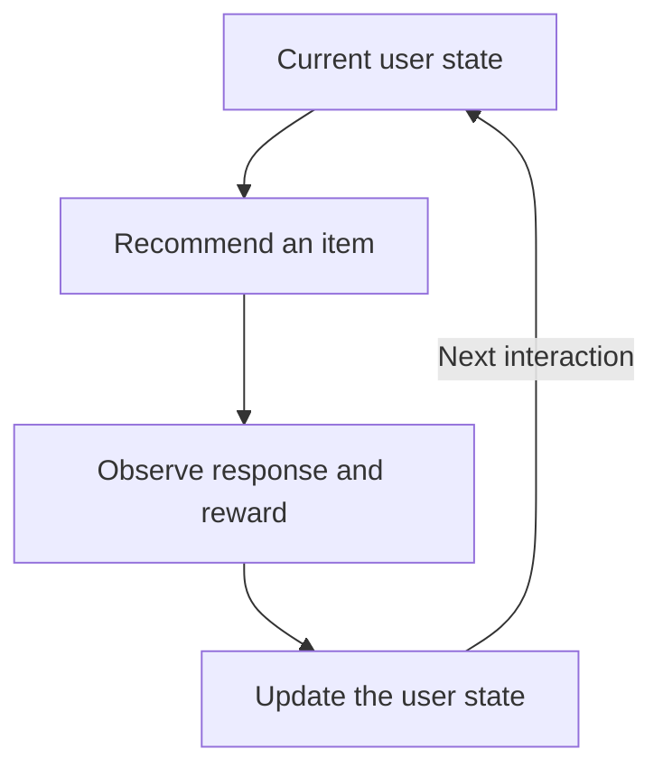

A **reward** is a number supplied by the environment after an action. It communicates the task's objective. The agent's goal is to maximize expected cumulative reward, with the precise definition of that cumulative reward introduced in the next section.

## Reward describes what success means

In the gridworld from [3.1](/Reinforcement-Learning/chapters/03-markov-decision-processes/01-agent-env-interface/), entering Goal gives +5 and every other move gives −1. These rules favor reaching Goal with fewer moves.

The agent chooses its actions. It does not get to change the reward rules to make its score larger. A **policy** is the behavior it learns to do well under those rules.

| Task | A possible reward | What that encourages |
| --- | --- | --- |
| Reach a destination | −1 per move until arrival | Shorter routes |
| Balance a pole | +1 for each step before falling | Longer balancing |
| Win a game | +1 for a win, 0 for a draw, −1 for a loss | Better final outcomes |

Reward design depends on the intended task. These examples specify particular objectives; they are not interchangeable for every application.

## Immediate reward versus long-term success

Moving from Start to Hall gives −1. That action can still be useful because the next move reaches Goal and gives +5. A negative immediate reward does not automatically mean that an action is bad.

The useful question is: **How does this action affect the rewards that come afterward?** Return measures those future rewards, and value averages return over possible outcomes.

## Specify the goal without prescribing every action

A reward should express the outcome we want. Rewarding a particular intermediate behavior can accidentally encourage that behavior even when it stops helping the task.

Suppose we change the rules: entering Hall gives +1 on every visit, other nonterminal moves give 0, and entering Goal still gives +5. With $\gamma=1$ and a 30-step limit, the robot could earn +15 by moving between Start and Hall for the entire episode, compared with +6 for going directly through Hall to Goal. The agent would be improving the supplied score while failing to finish the trip we intended.

Before accepting a reward rule, ask:

- Can the agent collect rewards repeatedly without achieving the goal?
- Does a penalty discourage something necessary for eventual success?
- Does the reward account for the outcome we actually care about?

## Example: recommendations over time

A recommendation changes what the user experiences and possibly what they want next. Optimizing immediate clicks alone may produce a different policy from optimizing a defined measure of satisfaction over a whole session.

An MDP model must specify which aspects of the user history are represented in the state and what numerical feedback counts as reward. “Make good recommendations” is an intention; a state representation and reward rule make it a concrete decision problem.

## Remember

**Reward is immediate feedback. Return is accumulated future reward. Value is expected return.** Keeping these three quantities separate prevents many mistakes later.

## Reference

Sutton, R. S. & Barto, A. G. *Reinforcement Learning: An Introduction*, 2nd ed., chapter 3, section 3.2. The explanations and small worked examples here are written for these notes.

---

[Previous: 3.1 The Agent–Environment Interface](/Reinforcement-Learning/chapters/03-markov-decision-processes/01-agent-env-interface/) · [Next: 3.3 Returns and Episodes](/Reinforcement-Learning/chapters/03-markov-decision-processes/03-returns-and-episodes/)
