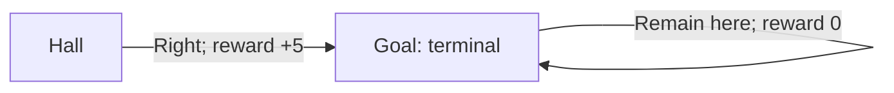

Episodic and continuing tasks can use the same return formula. The trick is to imagine that, after an episode ends, the process remains in a terminal state and receives zero rewards forever.

## An absorbing terminal state

A terminal state is **absorbing** when its next state is itself with probability one. After termination, we can imagine a dummy action that keeps the process there and produces reward 0. The real agent does not need to keep acting; this is a mathematical convention.

If the gridworld episode ends at $T=2$, its reward sequence can be written as:

$$
R_1=-1,\quad R_2=5,\quad R_3=R_4=\cdots=0.
$$

The goal reward is paid on entry. It is not paid again by the terminal self-loop.

## One formula for both task types

For an episode ending at $T$, the finite return is:

$$
G_t = \sum_{k=0}^{T-t-1} \gamma^k R_{t+k+1}.
$$

Once rewards after $T$ are defined to be zero, this is the same as:

$$
G_t = \sum_{k=0}^{\infty} \gamma^k R_{t+k+1}.
$$

A continuing task uses the same infinite sum without an artificial terminal state. Its return still needs to be well-defined; with bounded rewards, choosing $\gamma<1$ is sufficient.

| Quantity | Episodic task | Continuing task |
| --- | --- | --- |
| End time $T$ | A terminal time exists for an episode that finishes. | No natural terminal time. |
| Rewards after termination | Set to zero by convention. | Rewards continue according to the environment. |
| Discounting | May use $\gamma=1$ when returns remain well-defined. | Usually use $\gamma<1$ for discounted-return objectives. |
| Return recursion | $G_t=R_{t+1}+\gamma G_{t+1}$ | The same recursion. |

Let $\mathcal{S}$ denote nonterminal states and $\mathcal{S}^{+}$ include terminal states as well. When summing over possible next states, include the terminal states. Their future value is zero.

## Why terminal value is zero

At the end of an episode, $G_T=0$ because no rewards remain. Consequently, the terminal state's value is also zero.

For the policy that chooses right from Hall:

$$
v_\pi(\text{Hall}) = 5 + \gamma v_\pi(\text{Goal}) = 5 + \gamma(0) = 5.
$$

The value functions are defined formally in the next section. Here the important point is that **reward on arrival and value after arrival are different quantities**.

## Pole balancing: where the episode boundary matters

Suppose reward is 0 while the pole remains upright and −1 when it falls. If one episode ends with failure at time $T$, then for $t<T$:

$$
G_t = -\gamma^{T-t-1}.
$$

With $0<\gamma<1$, delaying failure makes its negative contribution closer to zero and therefore improves the return. With $\gamma=1$, every trajectory ending in one failure gives return −1, regardless of its duration. That reward rule alone would not distinguish short and long balancing episodes; giving +1 per surviving step would define a different objective.

In a continuing formulation, assume each failure is followed by a reset, resets yield no additional reward, and future failure times are $T_1,T_2,\ldots$, all greater than the current time $t$. Then:

$$
G_t = -\sum_{i=1}^{\infty}\gamma^{T_i-t-1}.
$$

The episodic return counts this episode's failure. The continuing return counts all future failures, including those after resets. Choosing the episode boundary therefore affects what the agent is optimizing.

## Reference

Sutton, R. S. & Barto, A. G. *Reinforcement Learning: An Introduction*, 2nd ed., chapter 3, section 3.4. The explanations and small worked examples here are written for these notes.

---

[Previous: 3.3 Returns and Episodes](/Reinforcement-Learning/chapters/03-markov-decision-processes/03-returns-and-episodes/) · [Next: 3.5 Policies and Value Functions](/Reinforcement-Learning/chapters/03-markov-decision-processes/05-policies-and-value-functions/)
