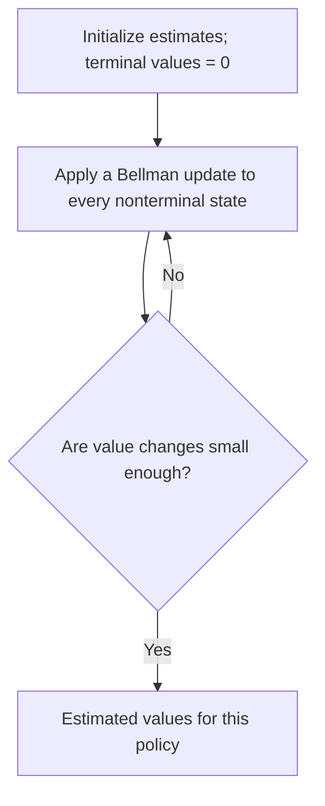

An MDP gives the rules of the problem. A **policy** chooses actions within those rules. A **value function** measures the expected return when following a policy.

## Policies: what will the agent do?

A deterministic policy chooses one action for each nonterminal state:

$$
A_t = \pi(S_t).
$$

For our gridworld, consider the policy that chooses right in Start and Hall and up in B, C, and D. This completely specifies its behavior in every nonterminal cell.

A stochastic policy assigns probabilities to actions:

$$
\pi(a \mid s) = \Pr(A_t=a \mid S_t=s),\qquad \sum_a \pi(a \mid s)=1.
$$

For example, in Hall it might choose right with probability 0.8 and down with probability 0.2. This randomness belongs to the agent's choice. Slippery movement belongs to the environment's response. Either or both can be random.

## State value and action value

The **state-value function** asks: “Starting in this state, what return do I expect if I follow policy $\pi$?”

$$
v_\pi(s) = \mathbb{E}_\pi\left[G_t \mid S_t=s\right].
$$

The **action-value function** asks: “What if I take this particular action first, then follow $\pi$?”

$$
q_\pi(s,a) = \mathbb{E}_\pi\left[G_t \mid S_t=s,\ A_t=a\right].
$$

The expectation averages over any randomness in actions, transitions, and rewards. A return describes one realized trajectory; a value is an expectation over the possible trajectories.

| Quantity | First action | Later actions |
| --- | --- | --- |
| $v_\pi(s)$ | Chosen by $\pi$. | Follow $\pi$. |
| $q_\pi(s,a)$ | Fix it to $a$. | Follow $\pi$. |

## Values in the gridworld

Under the deterministic policy above and $\gamma=0.9$:

| State | Rewards still to come | State value |
| --- | --- | --- |
| Goal | None: the episode has ended. | $0$ |
| Hall | $+5$ | $5$ |
| Start | $-1$, then $+5$ | $3.5$ |

Entering Hall pays −1, but **Hall has value 5** because of the reward that comes next. A different policy can give the same cell a different value: a policy that repeatedly hits a wall in Hall never collects the goal reward.

## Bellman expectation: look ahead one step

The return satisfies:

$$
G_t = R_{t+1} + \gamma G_{t+1}.
$$

Taking expectations under a policy gives the Bellman expectation equation:

$$
v_\pi(s) = \mathbb{E}_\pi\left[R_{t+1}+\gamma v_\pi(S_{t+1}) \mid S_t=s\right].
$$

In words: **value here = expected next reward + discounted value of where you land**.

For our deterministic route:

$$
v_\pi(\text{Start}) = -1 + 0.9\,v_\pi(\text{Hall}) = 3.5.
$$

For a finite MDP, writing out both sources of randomness gives:

$$
v_\pi(s) = \sum_a \pi(a \mid s)\sum_{s',r}p(s',r \mid s,a)\left[r+\gamma v_\pi(s')\right].
$$

The inner sum averages the environment's possible outcomes for an action. The outer sum averages over actions chosen by the policy. Neither sum means “choose the best”; we are evaluating the given policy.

## Connect state and action values

Fix the first action and average over the environment's response:

$$
q_\pi(s,a) = \sum_{s',r}p(s',r \mid s,a)\left[r+\gamma v_\pi(s')\right].
$$

Average those action values using the policy to recover state value:

$$
v_\pi(s) = \sum_a \pi(a \mid s)q_\pi(s,a).
$$

Substituting this relationship at the next state gives the action-value Bellman expectation equation:

$$
q_\pi(s,a) = \sum_{s',r}p(s',r \mid s,a)\left[r+\gamma\sum_{a'}\pi(a' \mid s')q_\pi(s',a')\right].
$$

At a terminal next state, the future contribution is zero; the inner action average is omitted or represented using a zero-valued dummy action.

## Preview: iterative policy evaluation

For a finite discounted MDP with a known model, one way to evaluate a policy is to initialize estimates $V_0$ and repeatedly apply Bellman updates:

$$
V_{k+1}(s) = \sum_a\pi(a \mid s)\sum_{s',r}p(s',r \mid s,a)\left[r+\gamma V_k(s')\right].
$$

Here $k$ counts update sweeps, not environment time steps. Keep terminal values at zero. For $\gamma<1$, these synchronous updates converge to $v_\pi$; a practical implementation stops when changes fall below a chosen tolerance.

This is a preview of [dynamic programming](/Reinforcement-Learning/chapters/04-dynamic-programming/). The key distinction here is between the value $v_\pi$ we want and the estimates $V_k$ used to compute it.

## Reference

Sutton, R. S. & Barto, A. G. *Reinforcement Learning: An Introduction*, 2nd ed., chapter 3, section 3.5. The explanations and small worked examples here are written for these notes.

---

[Previous: 3.4 Unified Notation for Episodic and Continuing Tasks](/Reinforcement-Learning/chapters/03-markov-decision-processes/04-unified-notation/) · [Next: 3.6 Optimal Policies and Optimal Value Functions](/Reinforcement-Learning/chapters/03-markov-decision-processes/06-optimal-policies-and-value-functions/)
