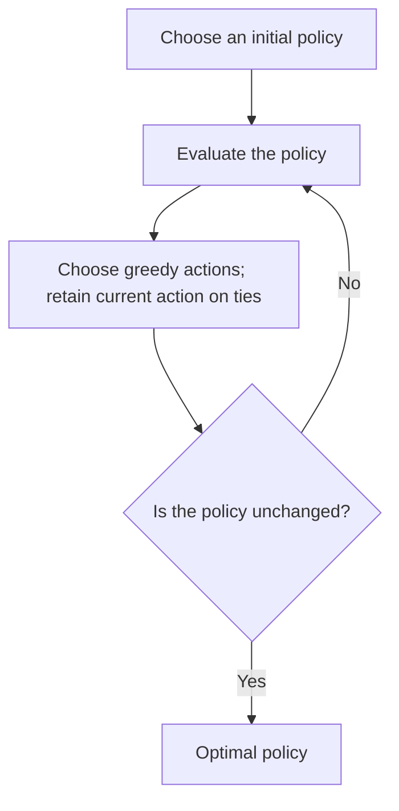

Policy evaluation asks how well a given policy behaves. **Control** asks which policy achieves the greatest expected return.

## What does optimal mean?

A policy $\pi$ is at least as good as $\pi'$ if $v_\pi(s)\geq v_{\pi'}(s)$ for every state $s$. Two arbitrary policies need not be ordered this way: one can be better in one state and worse in another.

For a finite discounted MDP with bounded rewards, there exists an optimal policy that achieves the best possible value in every state. There may be several optimal policies, but they share the optimal value functions:

$$
v_*(s) = \max_\pi v_\pi(s),\qquad q_*(s,a) = \max_\pi q_\pi(s,a).
$$

In $q_*(s,a)$, the first action is fixed to $a$; optimal behavior begins afterward. Optimality concerns **expected return**, not a guarantee that every random trajectory earns the largest reward.

## Bellman optimality for state value

Instead of averaging over a given policy's action choices, choose the action with the highest expected return:

$$
v_*(s) = \max_a\sum_{s',r}p(s',r \mid s,a)\left[r+\gamma v_*(s')\right].
$$

The maximum is over actions. The environment's possible outcomes are still averaged. The agent cannot choose a lucky outcome directly.

In the gridworld, right and down at Start both give immediate reward −1. Right reaches Hall, from which the next move can earn +5. Down requires a longer route. Looking at the future makes the difference.

## Bellman optimality for action value

After taking action $a$, choose the best action at the next state:

$$
q_*(s,a) = \sum_{s',r}p(s',r \mid s,a)\left[r+\gamma\max_{a'}q_*(s',a')\right].
$$

The two optimal value functions satisfy:

$$
v_*(s) = \max_a q_*(s,a).
$$

As before, terminal future value is zero. The pattern “reward now plus discounted best next value” will return later in Q-learning, where experience supplies samples instead of a full model sum.

## Obtain an optimal policy

If $q_*$ is known, choose any maximizing action:

$$
\pi_*(s) \in \operatorname*{arg\,max}_a q_*(s,a).
$$

The membership symbol reminds us that ties can give several valid choices. An optimal policy can choose one consistently or randomize among maximizing actions.

If only $v_*$ is known, choosing an action requires a one-step lookahead using the transition and reward model:

$$
\pi_*(s) \in \operatorname*{arg\,max}_a\sum_{s',r}p(s',r \mid s,a)\left[r+\gamma v_*(s')\right].
$$

Greedy action selection with the true $q_*$ needs no explicit model at decision time. Learning those values is still a separate problem.

## A repeating route: value is not proof of optimality

Consider a different, continuing gridworld with a special transition from $A$ to $A'$ that pays +10. Suppose a chosen policy then takes four zero-reward moves back to $A$ and repeats. Its reward sequence is $10,0,0,0,0,10,\ldots$.

With $\gamma=0.9$, the value of this route is:

$$
v_\pi(A) = 10 + 0.9^5(10) + 0.9^{10}(10)+\cdots = \frac{10}{1-0.9^5} \approx 24.419.
$$

Equivalently, $v_\pi(A)=10+\gamma^5v_\pi(A)$. This calculation evaluates the repeating route. Calling it $v_*(A)$ would additionally require checking that no alternative route or action has greater value under the complete environment rules.

This continuing example is separate from the chapter's Start–Hall–Goal gridworld, which ends on reaching Goal.

## From evaluation to improvement

In a finite discounted MDP, exact policy iteration alternates between evaluating a policy and choosing actions greedily with respect to its values. Retaining the current action when it already maximizes value avoids unnecessary switching between tied actions.

[Dynamic programming](/Reinforcement-Learning/chapters/04-dynamic-programming/) develops policy iteration and value iteration. This section defines the optimal values those methods seek.

## Reference

Sutton, R. S. & Barto, A. G. *Reinforcement Learning: An Introduction*, 2nd ed., chapter 3, section 3.6. The explanations and small worked examples here are written for these notes.

---

[Previous: 3.5 Policies and Value Functions](/Reinforcement-Learning/chapters/03-markov-decision-processes/05-policies-and-value-functions/) · [Next: 3.7 Optimality and Approximation](/Reinforcement-Learning/chapters/03-markov-decision-processes/07-optimality-and-approximation/)
