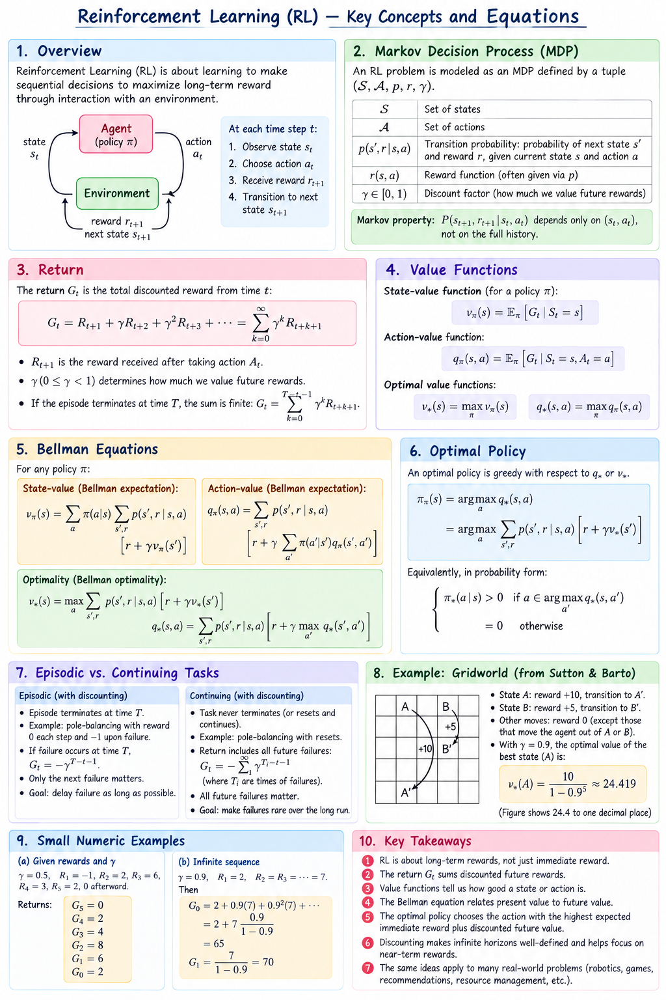

A **Markov decision process (MDP)** describes sequential decisions: the agent observes a state, chooses an action, and receives a reward and a next state. The goal is to choose a policy with high expected return.

## Image summary

The image is a quick map of the chapter. “Reward + future value” in its Bellman panel means **expected reward plus discounted future value**. The policy-evaluation panel previews methods developed in the next chapter.

## Read the chapter

The seven sections follow this order. They share a small gridworld introduced in section 3.1.

| Section | What you will learn |
| --- | --- |
| [3.1 The Agent–Environment Interface](/Reinforcement-Learning/chapters/03-markov-decision-processes/01-agent-environment-interface/) | States, actions, transition dynamics, and the Markov property. |
| [3.2 Goals and Rewards](/Reinforcement-Learning/chapters/03-markov-decision-processes/02-goals-and-rewards/) | Express the task through rewards while distinguishing immediate feedback from long-term success. |
| [3.3 Returns and Episodes](/Reinforcement-Learning/chapters/03-markov-decision-processes/03-returns-and-episodes/) | Calculate finite and discounted returns, including backward calculations and infinite sequences. |
| [3.4 Unified Notation for Episodic and Continuing Tasks](/Reinforcement-Learning/chapters/03-markov-decision-processes/04-unified-notation/) | Use an absorbing terminal state and zero future rewards to write one return formula for both task types. |
| [3.5 Policies and Value Functions](/Reinforcement-Learning/chapters/03-markov-decision-processes/05-policies-and-value-functions/) | Define policies, state and action values, and the Bellman expectation equations. |
| [3.6 Optimal Policies and Optimal Value Functions](/Reinforcement-Learning/chapters/03-markov-decision-processes/06-optimal-policies-and-value-functions/) | Compare policies, derive Bellman optimality, and choose actions from optimal values. |
| [3.7 Optimality and Approximation](/Reinforcement-Learning/chapters/03-markov-decision-processes/07-optimality-and-approximation/) | Understand why optimality is a useful target and why practical agents use estimates and approximation. |

## Reference

Sutton, R. S. & Barto, A. G. *Reinforcement Learning: An Introduction*, 2nd ed., chapter 3: Finite Markov Decision Processes.
